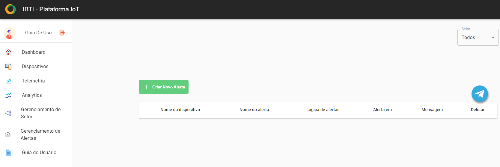

Gerenciamento de alertas 
=========================

Em gerenciamento de alertas é possível realizar o cadastro e exclusão, a mensagem a ser enviada, a lógica dos alertas referentes à determinado dispositivo.

Cadastrando um alerta
----------------------
01. No menu lateral clique em “Gerenciamento de Alertas”.
02. Clique em “+Criar Novo Alerta”.

Cadastrando um alerta através do Bot Telegram 
-----------------------------------------------