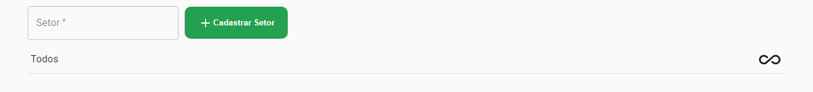
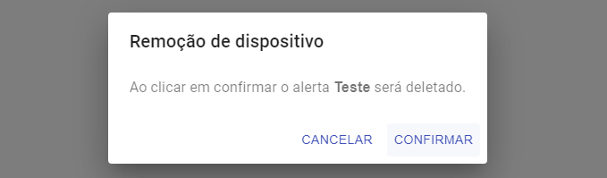

Gerenciamento de setores
===========================
Em gerenciamento de setor é possível adicionar e remover setores para os dispositivos, o gerenciamento não afeta diretamente o dispositivo, apenas o setor cadastrado.

Cadastrando um setor 
----------------------

01. No menu lateral clique em “Gerenciamento de Setor”.

.. figure:: images/v27.png
    :width: 70%
    :align: left

02. Na tela de gerenciamento preencha o campo setor e clique em "+Cadastrar Setor” para cadastrar um novo setor

03. Excluindo um setor. Para um setor vá até o gerenciamento de setores através do menu lateral e clique no botão de exclusão que possui o ícone de uma lixeira.

04. Após clicar no botão de exclusão do setor uma mensagem de confirmação será exibida basta clicar no botão “confirmar”.

