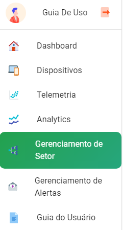

Gerenciamento de setores
===========================
Em gerenciamento de setor é possível adicionar e remover setores para os dispositivos, o gerenciamento não afeta diretamente o dispositivo, apenas o setor cadastrado.

Cadastrando um setor 
----------------------

01. No menu lateral clique em “Gerenciamento de Setor”.

